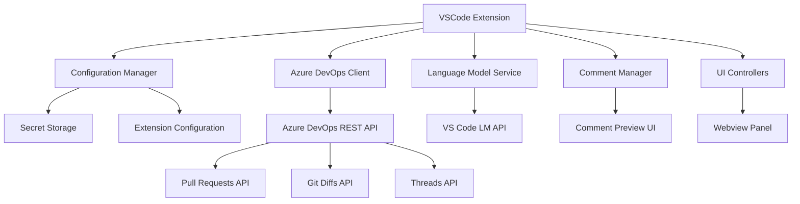

# Design Document

## Overview

The Azure DevOps PR Code Reviewer extension will be implemented as a VSCode extension that integrates with Azure DevOps REST APIs and VS Code's Language Model API to provide automated code review capabilities. The extension will authenticate using Personal Access Tokens, analyze pull request file changes, leverage AI models for code analysis, and facilitate posting review comments back to Azure DevOps.

The extension will follow VSCode's extension development patterns, utilizing the Command API for user interactions, Secret Storage for secure token management, Configuration API for user settings, and the Language Model API for AI-powered code analysis.

## Architecture

### High-Level Architecture



### Core Components

1. **Extension Host**: Main extension entry point and lifecycle management
2. **Configuration Manager**: Handles PAT tokens, model selection, and custom instructions
3. **Azure DevOps Client**: Manages API communication with Azure DevOps services
4. **Language Model Service**: Interfaces with VS Code's LM API for code analysis
5. **Comment Manager**: Manages review comment generation, preview, and posting
6. **UI Controllers**: Handles user interface components and interactions

### Data Flow

1. User configures PAT token and preferences through extension settings
2. User triggers PR analysis command
3. Extension fetches open PRs from Azure DevOps
4. User selects specific PR for review
5. Extension retrieves file changes and diffs
6. Each change is analyzed using the selected language model
7. Generated comments are presented in preview interface
8. User reviews, edits, and approves comments
9. Extension posts approved comments to Azure DevOps PR

## Components and Interfaces

### Configuration Manager

**Purpose**: Manages secure storage and retrieval of user configuration data.

**Key Methods**:
- `getPatToken(): Promise<string | undefined>` - Retrieves stored PAT token
- `setPatToken(token: string): Promise<void>` - Securely stores PAT token
- `validatePatToken(token: string): Promise<boolean>` - Validates token against Azure DevOps
- `getSelectedModel(): string` - Gets user's preferred language model
- `getCustomInstructions(): string` - Retrieves custom review instructions

**Dependencies**: VSCode Secret Storage API, Extension Configuration API

### Azure DevOps Client

**Purpose**: Provides abstraction layer for Azure DevOps REST API interactions.

**Key Methods**:
- `getOpenPullRequests(organization: string, project: string): Promise<PullRequest[]>`
- `getPullRequestChanges(pullRequestId: number): Promise<FileChange[]>`
- `createCommentThread(pullRequestId: number, comment: CommentThread): Promise<void>`

**Data Models**:
```typescript
interface PullRequest {
  pullRequestId: number;
  title: string;
  description: string;
  sourceRefName: string;
  targetRefName: string;
  createdBy: IdentityRef;
  creationDate: Date;
}

interface FileChange {
  item: GitItem;
  changeType: 'add' | 'edit' | 'delete';
  sourceServerItem?: string;
  url: string;
}

interface CommentThread {
  comments: Comment[];
  status: 'active' | 'fixed' | 'wontFix';
  threadContext: CommentThreadContext;
}
```

**Dependencies**: Azure DevOps REST API v7.1

### Language Model Service

**Purpose**: Interfaces with VS Code's Language Model API for code analysis.

**Key Methods**:
- `getAvailableModels(): Promise<LanguageModelChat[]>` - Lists available models
- `analyzeCodeChange(change: FileChange, instructions: string): Promise<ReviewComment>` - Analyzes code and returns review feedback
- `buildPrompt(change: FileChange, instructions: string): LanguageModelChatMessage[]` - Constructs analysis prompt

**Integration Pattern**:
```typescript
const models = await vscode.lm.selectChatModels({ 
  vendor: 'copilot', 
  family: userSelectedFamily 
});

const prompt = [
  vscode.LanguageModelChatMessage.User(customInstructions),
  vscode.LanguageModelChatMessage.User(`Review the following code change:\n${codeChange}`)
];

const response = await model.sendRequest(prompt, {}, cancellationToken);
```

**Dependencies**: VS Code Language Model API

### Comment Manager

**Purpose**: Manages the lifecycle of review comments from generation to posting.

**Key Methods**:
- `generateComments(changes: FileChange[]): Promise<ReviewComment[]>` - Generates comments for all changes
- `showCommentPreview(comments: ReviewComment[]): Promise<ReviewComment[]>` - Shows preview UI and returns edited comments
- `postCommentsToAzureDevOps(comments: ReviewComment[]): Promise<void>` - Posts approved comments

**UI Integration**: Utilizes VSCode Webview API for comment preview interface

### UI Controllers

**Purpose**: Manages user interface components and command handlers.

**Components**:
- **Command Handlers**: Register and handle extension commands
- **Webview Controller**: Manages webview panels for comment preview
- **Status Bar Integration**: Shows progress and status updates
- **Quick Pick Providers**: For PR and model selection

**Key Commands**:
- `azdo-pr-reviewer.configure` - Open configuration settings
- `azdo-pr-reviewer.analyzePR` - Start PR analysis workflow
- `azdo-pr-reviewer.selectModel` - Choose language model

## Data Models

### Core Data Structures

```typescript
// Configuration Models
interface ExtensionConfig {
  organizationUrl: string;
  defaultProject?: string;
  selectedModel: string;
  customInstructions: string;
  batchSize: number;
}

// Review Models
interface ReviewComment {
  id: string;
  fileName: string;
  lineNumber: number;
  content: string;
  severity: 'info' | 'warning' | 'error';
  suggestion?: string;
  isApproved: boolean;
}

// Azure DevOps Models
interface CommentThreadContext {
  filePath: string;
  rightFileStart: CommentPosition;
  rightFileEnd: CommentPosition;
}

interface CommentPosition {
  line: number;
  offset: number;
}
```

### State Management

Extension will maintain state using VSCode's context and workspace state APIs:
- **Global State**: User preferences, model selection
- **Workspace State**: Current PR context, analysis progress
- **Secrets**: PAT tokens stored securely

## Error Handling

### Error Categories and Strategies

1. **Authentication Errors**:
   - Invalid or expired PAT tokens
   - Insufficient permissions
   - Strategy: Clear error messages with token creation guidance

2. **API Rate Limiting**:
   - Azure DevOps API limits
   - VS Code LM API quotas
   - Strategy: Exponential backoff, user notification, retry mechanisms

3. **Network Errors**:
   - Connection timeouts
   - Service unavailability
   - Strategy: Retry with progressive delays, offline mode indicators

4. **Model Availability**:
   - Selected model unavailable
   - LM API access denied
   - Strategy: Fallback to available models, user consent prompts

5. **Data Processing Errors**:
   - Large file handling
   - Malformed API responses
   - Strategy: Chunked processing, graceful degradation

### Error Recovery Patterns

```typescript
async function withRetry<T>(
  operation: () => Promise<T>,
  maxRetries: number = 3,
  delay: number = 1000
): Promise<T> {
  for (let i = 0; i < maxRetries; i++) {
    try {
      return await operation();
    } catch (error) {
      if (i === maxRetries - 1) throw error;
      await new Promise(resolve => setTimeout(resolve, delay * Math.pow(2, i)));
    }
  }
}
```

## Testing Strategy

### Unit Testing Approach

1. **Configuration Manager Tests**:
   - Token validation logic
   - Settings persistence
   - Mocked VSCode APIs

2. **Azure DevOps Client Tests**:
   - API request formatting
   - Response parsing
   - Error handling scenarios
   - Mocked HTTP responses

3. **Language Model Service Tests**:
   - Prompt construction
   - Response interpretation
   - Model selection logic
   - Mocked LM API responses

### Integration Testing

1. **End-to-End Workflow Tests**:
   - Complete PR analysis flow
   - Comment posting workflow
   - Error recovery scenarios

2. **API Integration Tests**:
   - Azure DevOps API compatibility
   - VS Code LM API integration
   - Rate limiting behavior

### Testing Considerations

- **Non-deterministic LM Responses**: Test prompt construction and response parsing separately from actual model calls
- **Rate Limiting**: Use test doubles for integration tests to avoid quota consumption
- **Authentication**: Mock authentication flows to avoid exposing real credentials

### Manual Testing Scenarios

1. **Configuration Flow**: PAT token setup, model selection, custom instructions
2. **PR Analysis**: Different PR sizes, various file types, error conditions
3. **Comment Management**: Preview interface, editing, posting, error handling
4. **Performance**: Large PRs, network delays, concurrent operations

## Security Considerations

### Token Management

- **Secure Storage**: Use VSCode's Secret Storage API for PAT tokens
- **Token Validation**: Validate tokens before storage and on extension activation
- **Scope Verification**: Ensure tokens have required permissions for PR operations

### API Security

- **HTTPS Only**: All API communications over HTTPS
- **Input Validation**: Sanitize all user inputs and API responses
- **Rate Limiting Respect**: Honor API rate limits to prevent service abuse

### Data Privacy

- **Code Privacy**: Only send necessary code excerpts to language models
- **User Consent**: Clear consent flow for LM API usage
- **Data Retention**: No local storage of sensitive code content

## Performance Optimization

### Efficient Processing

1. **Batch Processing**: Process file changes in configurable batches
2. **Parallel Analysis**: Concurrent language model requests where possible
3. **Caching Strategy**: Cache PR metadata and unchanged file analysis
4. **Progressive Loading**: Stream results as they become available

### Resource Management

1. **Memory Management**: Clean up large objects between batches
2. **Request Throttling**: Respect API rate limits with intelligent queuing
3. **Cancellation Support**: Allow users to cancel long-running operations
4. **Progress Indicators**: Show detailed progress for multi-step operations

### Scalability Considerations

- **Large PRs**: Handle PRs with 100+ file changes efficiently
- **Large Files**: Process only changed sections of large files
- **Network Resilience**: Graceful handling of network interruptions
- **Model Fallbacks**: Automatic fallback to faster models when needed