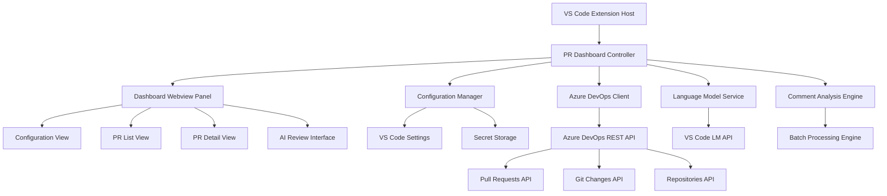
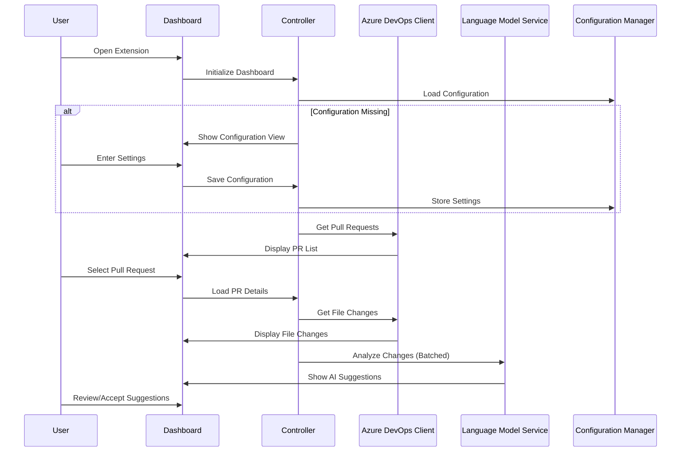

# Design Document

## Overview

The PR UI Dashboard feature transforms the current Azure DevOps PR Code Reviewer extension from a command-based interface to a comprehensive webview-based dashboard. This new interface will provide users with an intuitive way to manage Azure DevOps configurations, browse pull requests, view file changes, and interact with AI-powered code review suggestions.

The design leverages the existing VS Code webview infrastructure and builds upon the current Azure DevOps client, comment management system, and language model services. The UI will be implemented as a persistent webview panel that serves as the primary interface for all extension functionality.

## Architecture

### High-Level Architecture



### Component Interaction Flow



## Components and Interfaces

### PR Dashboard Controller

**Purpose**: Main orchestrator that manages the webview panel and coordinates between different services.

**Responsibilities**:
- Webview panel lifecycle management
- Message routing between webview and extension services
- State management for current view and selected PR
- Error handling and user feedback
- Progress tracking for batch operations

**Key Methods**:
```typescript
class PRDashboardController {
    createDashboard(): Promise<void>
    showConfiguration(): void
    loadPullRequests(): Promise<PullRequest[]>
    loadPullRequestDetails(prId: number): Promise<void>
    startAIAnalysis(fileChanges: FileChange[]): Promise<void>
    handleWebviewMessage(message: WebviewMessage): void
}
```

### Dashboard Webview Components

**Purpose**: Frontend UI components implemented in HTML/CSS/JavaScript for the webview.

#### Configuration View
- Form for Azure DevOps organization URL and PAT token
- Model selection dropdown
- Custom instructions textarea
- Batch size and performance settings
- Connection test functionality
- Visual validation feedback

#### PR List View
- Filterable table/grid of available pull requests
- Sorting by date, author, status, title
- Search functionality
- Pagination for large result sets
- Refresh capability
- Quick action buttons (analyze, view details)

#### PR Detail View
- File tree structure showing changed files
- Diff viewer with syntax highlighting
- Side-by-side or unified diff options
- File statistics (additions, deletions, modifications)
- Navigation breadcrumbs
- Back to list functionality

#### AI Review Interface
- Progress indicators for batch processing
- Real-time comment suggestions display
- Inline comment editing and approval
- Batch actions (approve all, dismiss all)
- Severity filtering (error, warning, info)
- Export to Azure DevOps functionality

### Enhanced Azure DevOps Client

**Purpose**: Extended API client with additional methods for UI dashboard functionality.

**New Methods**:
```typescript
interface AzureDevOpsClient {
    getOpenPullRequests(project?: string, top?: number, skip?: number): Promise<PullRequest[]>
    getPullRequestsByAuthor(author: string, project?: string): Promise<PullRequest[]>
    searchPullRequests(query: string, project?: string): Promise<PullRequest[]>
    getPullRequestFileTree(project: string, repositoryId: string, pullRequestId: number): Promise<FileTreeNode[]>
}
```

### Dashboard State Manager

**Purpose**: Manages the current state of the dashboard including navigation, filters, and user preferences.

**State Structure**:
```typescript
interface DashboardState {
    currentView: 'configuration' | 'pr-list' | 'pr-detail' | 'ai-review'
    selectedPR?: PullRequest
    prListFilters: {
        author?: string
        status?: 'active' | 'completed' | 'abandoned'
        dateRange?: { from: Date; to: Date }
        searchText?: string
    }
    prDetailState: {
        selectedFile?: string
        diffViewMode: 'side-by-side' | 'unified'
        showWhitespace: boolean
    }
    aiReviewState: {
        batchProgress: number
        currentBatch: number
        totalBatches: number
        filters: {
            severity?: 'error' | 'warning' | 'info'
            showApproved: boolean
        }
    }
}
```

### Message Protocol

**Purpose**: Defines communication between webview and extension host.

**Message Types**:
```typescript
interface DashboardMessage {
    type: 'navigation' | 'configuration' | 'pr-action' | 'ai-action' | 'filter-update'
    payload: any
}

// Navigation Messages
interface NavigationMessage extends DashboardMessage {
    type: 'navigation'
    payload: {
        view: 'configuration' | 'pr-list' | 'pr-detail' | 'ai-review'
        data?: any
    }
}

// Configuration Messages
interface ConfigurationMessage extends DashboardMessage {
    type: 'configuration'
    payload: {
        action: 'save' | 'test' | 'reset'
        config?: ExtensionConfig
    }
}

// Pull Request Messages
interface PRActionMessage extends DashboardMessage {
    type: 'pr-action'
    payload: {
        action: 'select' | 'refresh' | 'analyze' | 'filter'
        prId?: number
        filters?: PRFilters
    }
}

// AI Review Messages
interface AIActionMessage extends DashboardMessage {
    type: 'ai-action'
    payload: {
        action: 'start' | 'approve' | 'dismiss' | 'edit' | 'export'
        commentId?: string
        content?: string
    }
}
```

## Data Models

### Extended Pull Request Model

```typescript
interface EnhancedPullRequest extends PullRequest {
    // Additional UI-specific properties
    formattedCreationDate: string
    relativeCreationDate: string
    authorAvatarUrl?: string
    statusIcon: string
    statusColor: string
    changedFilesCount: number
    totalLinesChanged: number
    lastActivityDate: Date
}
```

### File Tree Structure

```typescript
interface FileTreeNode {
    path: string
    name: string
    type: 'file' | 'folder'
    changeType: 'add' | 'edit' | 'delete' | 'rename'
    children?: FileTreeNode[]
    linesAdded?: number
    linesDeleted?: number
    isExpanded?: boolean
    isBinary?: boolean
}
```

### AI Analysis Progress

```typescript
interface AnalysisProgress {
    totalFiles: number
    processedFiles: number
    currentBatch: number
    totalBatches: number
    currentFile?: string
    status: 'initializing' | 'processing' | 'completed' | 'error'
    error?: string
    startTime: Date
    estimatedCompletion?: Date
}
```

## Error Handling

### Error Categories

1. **Configuration Errors**
   - Invalid Azure DevOps URL format
   - Authentication failures
   - Missing or invalid PAT token
   - Network connectivity issues

2. **Data Loading Errors**
   - API rate limiting
   - Resource not found (PR, repository)
   - Permission denied
   - Service unavailable

3. **AI Processing Errors**
   - Language model unavailable
   - Token limit exceeded
   - Analysis timeout
   - Batch processing failures

### Error Recovery Strategies

```typescript
interface ErrorRecoveryStrategy {
    category: 'configuration' | 'data-loading' | 'ai-processing'
    retryable: boolean
    maxRetries?: number
    retryDelay?: number
    fallbackAction?: () => void
    userMessage: string
    actionButtons?: Array<{
        label: string
        action: () => void
    }>
}
```

### User Feedback Patterns

- **Non-blocking notifications** for background operations
- **Modal dialogs** for critical configuration errors
- **Inline error messages** for form validation
- **Progress indicators** with cancel options for long operations
- **Toast notifications** for success confirmations

## Testing Strategy

### Unit Testing

**Test Coverage Areas**:
- Dashboard controller message handling
- State management and navigation
- Azure DevOps client API methods
- Configuration validation logic
- Error handling scenarios

**Test Frameworks**:
- Mocha for test runner
- Sinon for mocking VS Code APIs
- Chai for assertions

### Integration Testing

**Test Scenarios**:
- End-to-end dashboard workflow
- Azure DevOps API integration
- Webview message communication
- Configuration persistence
- AI analysis batch processing

### User Acceptance Testing

**Test Cases**:
- First-time user configuration setup
- Pull request browsing and selection
- File change viewing and navigation
- AI suggestion review and approval
- Error scenarios and recovery

### Performance Testing

**Metrics to Monitor**:
- Dashboard load time (< 3 seconds)
- PR list rendering performance (< 2 seconds)
- File diff loading time (< 2 seconds)
- AI batch processing throughput
- Memory usage during large PR analysis

## Security Considerations

### Data Protection

- **PAT Token Storage**: Secure storage using VS Code's secret management API
- **API Communication**: HTTPS only, proper certificate validation
- **Cross-Origin Security**: Strict CSP policies for webview content
- **Input Validation**: Sanitization of all user inputs and API responses

### Access Control

- **Principle of Least Privilege**: Only request necessary Azure DevOps permissions
- **Session Management**: Automatic token refresh and expiration handling
- **Audit Logging**: Track configuration changes and API access patterns

### Privacy

- **Telemetry**: Opt-in only, no code content in telemetry data
- **Local Storage**: Minimize persistent storage, clear on uninstall
- **Data Transmission**: Only send necessary data to Azure DevOps APIs

## Performance Optimization

### Rendering Optimization

- **Virtual Scrolling**: For large pull request lists
- **Lazy Loading**: File content loaded on demand
- **Code Splitting**: Separate bundles for different views
- **Caching**: API response caching with appropriate TTL

### Memory Management

- **Component Cleanup**: Proper disposal of event listeners and resources
- **Large File Handling**: Streaming for files > 1MB
- **Batch Size Tuning**: Configurable batch sizes based on system resources

### Network Optimization

- **Request Batching**: Combine multiple API calls where possible
- **Compression**: Enable gzip compression for API responses
- **Retry Logic**: Exponential backoff for failed requests
- **Connection Pooling**: Reuse HTTP connections for API calls

## Accessibility

### WCAG 2.1 Compliance

- **Keyboard Navigation**: Full keyboard accessibility
- **Screen Reader Support**: Proper ARIA labels and landmarks
- **High Contrast**: Support for high contrast themes
- **Focus Management**: Clear focus indicators and logical tab order

### VS Code Theme Integration

- **Color Scheme**: Automatically adapt to VS Code theme
- **Font Settings**: Respect user's font preferences
- **Icon Consistency**: Use VS Code's iconography
- **Animation Preferences**: Respect reduced motion settings

## Migration Strategy

### Backward Compatibility

- **Command Preservation**: Keep existing commands functional
- **Configuration Migration**: Automatic migration of existing settings
- **Progressive Enhancement**: Dashboard as optional interface

### Rollout Plan

1. **Phase 1**: Core dashboard structure and configuration view
2. **Phase 2**: Pull request list and detail views
3. **Phase 3**: AI review interface and batch processing
4. **Phase 4**: Advanced features (search, filters, export)

### Feature Flags

```typescript
interface FeatureFlags {
    enableDashboard: boolean
    enableAdvancedFilters: boolean
    enableBatchExport: boolean
    enableRealTimeUpdates: boolean
}
```