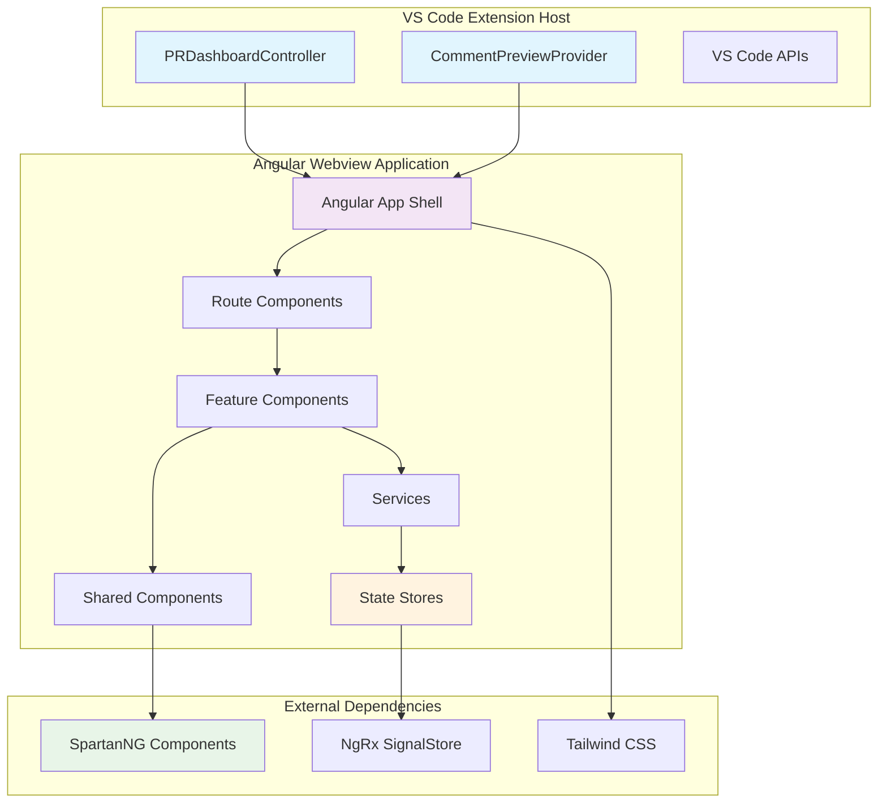

# Design Document

## Overview

This design document outlines the migration of the existing webview components from vanilla JavaScript/HTML/CSS to a modern Angular 20 application. The new architecture will leverage Angular's latest features including standalone components, signal-based reactivity, and the new control flow syntax. The application will use Tailwind CSS for styling, NgRx SignalStore for state management, and SpartanNG components for UI elements.

The migration will preserve all existing functionality while establishing a more maintainable, scalable, and developer-friendly codebase. The design follows Angular best practices and ensures seamless integration with VS Code's webview API.

## Architecture

### High-Level Architecture



### Project Structure

```
src/webview-angular/
├── src/
│   ├── app/
│   │   ├── core/
│   │   │   ├── services/
│   │   │   │   ├── vscode-api.service.ts
│   │   │   │   ├── message.service.ts
│   │   │   │   └── theme.service.ts
│   │   │   └── models/
│   │   │       ├── webview-message.interface.ts
│   │   │       ├── pull-request.interface.ts
│   │   │       └── comment.interface.ts
│   │   ├── features/
│   │   │   ├── dashboard/
│   │   │   │   ├── components/
│   │   │   │   ├── services/
│   │   │   │   └── store/
│   │   │   ├── comment-preview/
│   │   │   │   ├── components/
│   │   │   │   ├── services/
│   │   │   │   └── store/
│   │   │   └── shared/
│   │   │       ├── components/
│   │   │       └── ui/
│   │   ├── shared/
│   │   │   ├── components/
│   │   │   ├── directives/
│   │   │   └── pipes/
│   │   ├── app.component.ts
│   │   ├── app.config.ts
│   │   └── main.ts
│   ├── assets/
│   ├── styles/
│   │   ├── globals.css
│   │   └── vscode-theme.css
│   └── index.html
├── angular.json
├── package.json
├── tailwind.config.js
└── tsconfig.json
```

### Component Architecture

The application will use Angular's standalone components architecture with the following layers:

1. **App Shell**: Main application component that handles routing and global state
2. **Feature Components**: Dashboard and Comment Preview main components
3. **Presentation Components**: Reusable UI components using SpartanNG
4. **Services**: Business logic and external communication
5. **Stores**: State management using NgRx SignalStore

## Components and Interfaces

### Core Services

#### VSCodeApiService
Manages communication with the VS Code extension host using the webview API.

```typescript
@Injectable({ providedIn: 'root' })
export class VSCodeApiService {
  private vscodeApi = acquireVsCodeApi();
  
  sendMessage<T>(message: WebviewMessage<T>): void;
  onMessage<T>(): Observable<WebviewMessage<T>>;
  setState(state: any): void;
  getState(): any;
}
```

#### MessageService
Handles typed message communication between webview and extension host.

```typescript
@Injectable({ providedIn: 'root' })
export class MessageService {
  sendLoadConfig(): void;
  sendSaveConfig(config: ConfigurationData): void;
  sendLoadPullRequests(filters?: PullRequestFilters): void;
  sendStartAnalysis(pullRequestId: number): void;
  // ... other message methods
}
```

#### ThemeService
Manages VS Code theme integration and CSS custom properties.

```typescript
@Injectable({ providedIn: 'root' })
export class ThemeService {
  currentTheme$ = signal<'dark' | 'light'>('dark');
  
  initializeTheme(): void;
  updateThemeProperties(): void;
  observeThemeChanges(): void;
}
```

### Feature Components

#### Dashboard Component
Main dashboard component that orchestrates PR list, configuration, and analysis views.

```typescript
@Component({
  selector: 'app-dashboard',
  standalone: true,
  imports: [CommonModule, SpartanUIComponents],
  template: `
    <div class="dashboard-container">
      <app-dashboard-header />
      <app-dashboard-nav [activeView]="activeView()" />
      <main class="dashboard-main">
        @switch (activeView()) {
          @case ('configuration') {
            <app-configuration-view />
          }
          @case ('pullRequestList') {
            <app-pull-request-list />
          }
          @case ('pullRequestDetail') {
            <app-pull-request-detail />
          }
        }
      </main>
    </div>
  `
})
export class DashboardComponent {
  private dashboardStore = inject(DashboardStore);
  activeView = this.dashboardStore.activeView;
}
```

#### Comment Preview Component
Comment preview and editing interface component.

```typescript
@Component({
  selector: 'app-comment-preview',
  standalone: true,
  imports: [CommonModule, SpartanUIComponents],
  template: `
    <div class="comment-preview-container">
      <app-comment-header [stats]="stats()" />
      <app-comment-filters />
      <app-comment-list [comments]="filteredComments()" />
      <app-comment-actions />
    </div>
  `
})
export class CommentPreviewComponent {
  private commentStore = inject(CommentPreviewStore);
  stats = this.commentStore.summaryStats;
  filteredComments = this.commentStore.filteredComments;
}
```

### Shared UI Components

All shared components will utilize SpartanNG components for consistency:

- **Button Components**: Using `hlm-button`
- **Form Components**: Using `hlm-input`, `hlm-select`, `hlm-checkbox`
- **Data Components**: Using `hlm-table`, `hlm-card`, `hlm-badge`
- **Layout Components**: Using `hlm-accordion`, `hlm-tabs`
- **Feedback Components**: Using `hlm-alert`, `hlm-toast`

### SpartanNG Integration

SpartanNG provides a comprehensive component library with both "Brain" (headless) and "Helm" (styled) components:

- **Brain Components**: Provide accessibility and behavior
- **Helm Components**: Provide Tailwind-based styling
- **Customizable**: Can be themed to match VS Code's design system

Key components to be used:
- Tables for PR lists and file changes
- Cards for comment display
- Forms for configuration
- Buttons and badges for actions and status
- Accordions for collapsible sections

## Data Models

### Core Interfaces

```typescript
export interface WebviewMessage<T = any> {
  type: MessageType;
  payload?: T;
  requestId?: string;
}

export interface PullRequest {
  id: number;
  title: string;
  author: string;
  createdDate: string;
  status: PullRequestStatus;
  sourceRefName: string;
  targetRefName: string;
  description?: string;
  repository: string;
  isDraft: boolean;
  url: string;
}

export interface ReviewComment {
  id: string;
  content: string;
  filePath: string;
  lineNumber: number;
  severity: CommentSeverity;
  suggestion?: string;
  isApproved: boolean;
  isEditing?: boolean;
}

export interface ConfigurationData {
  organization: string;
  patToken: string;
  project: string;
  languageModel: string;
  enableTelemetry: boolean;
  customInstructions?: string;
}
```

### State Models

```typescript
export interface DashboardState {
  activeView: DashboardView;
  pullRequests: PullRequest[];
  selectedPullRequest?: PullRequest;
  configuration: ConfigurationData;
  loading: boolean;
  error?: string;
  analysisProgress?: AnalysisProgress;
}

export interface CommentPreviewState {
  comments: ReviewComment[];
  filters: CommentFilters;
  summaryStats: CommentSummaryStats;
  loading: boolean;
  error?: string;
}
```

## State Management with NgRx SignalStore

### Dashboard Store

```typescript
export const DashboardStore = signalStore(
  { providedIn: 'root' },
  withState<DashboardState>({
    activeView: DashboardView.PULL_REQUEST_LIST,
    pullRequests: [],
    selectedPullRequest: undefined,
    configuration: {} as ConfigurationData,
    loading: false,
    error: undefined,
    analysisProgress: undefined
  }),
  withComputed((store) => ({
    filteredPullRequests: computed(() => {
      // Apply filters to pull requests
      return store.pullRequests();
    }),
    hasConfiguration: computed(() => {
      const config = store.configuration();
      return !!(config.organization && config.patToken && config.project);
    })
  })),
  withMethods((store, messageService = inject(MessageService)) => ({
    loadPullRequests: () => {
      patchState(store, { loading: true });
      messageService.sendLoadPullRequests();
    },
    updateConfiguration: (config: Partial<ConfigurationData>) => {
      patchState(store, { 
        configuration: { ...store.configuration(), ...config }
      });
    },
    setActiveView: (view: DashboardView) => {
      patchState(store, { activeView: view });
    }
  }))
);
```

### Comment Preview Store

```typescript
export const CommentPreviewStore = signalStore(
  { providedIn: 'root' },
  withState<CommentPreviewState>({
    comments: [],
    filters: {
      severity: 'all',
      fileName: 'all',
      showApproved: true
    },
    summaryStats: {
      total: 0,
      errors: 0,
      warnings: 0,
      info: 0,
      approved: 0
    },
    loading: false,
    error: undefined
  }),
  withComputed((store) => ({
    filteredComments: computed(() => {
      const { comments, filters } = store;
      return comments().filter(comment => {
        // Apply filtering logic
        return true; // Simplified
      });
    }),
    commentsByFile: computed(() => {
      return groupBy(store.comments(), 'filePath');
    })
  })),
  withMethods((store, messageService = inject(MessageService)) => ({
    updateComment: (commentId: string, updates: Partial<ReviewComment>) => {
      const comments = store.comments().map(comment =>
        comment.id === commentId ? { ...comment, ...updates } : comment
      );
      patchState(store, { comments });
    },
    toggleApproval: (commentId: string) => {
      const comments = store.comments().map(comment =>
        comment.id === commentId 
          ? { ...comment, isApproved: !comment.isApproved }
          : comment
      );
      patchState(store, { comments });
    }
  }))
);
```

## Styling with Tailwind CSS

### Theme Integration

VS Code theme variables will be mapped to CSS custom properties and integrated with Tailwind's configuration:

```css
/* vscode-theme.css */
:root {
  /* Map VS Code theme variables */
  --vscode-foreground: var(--foreground);
  --vscode-background: var(--background);
  --vscode-button-background: var(--button-background);
  /* ... other variables */
}

/* Map to Tailwind semantic tokens */
:root {
  --color-primary: var(--vscode-button-background);
  --color-background: var(--vscode-background);
  --color-foreground: var(--vscode-foreground);
  --color-border: var(--vscode-panel-border);
}
```

### Tailwind Configuration

```javascript
// tailwind.config.js
module.exports = {
  content: ['./src/**/*.{html,ts}'],
  theme: {
    extend: {
      colors: {
        'vscode': {
          'foreground': 'var(--color-foreground)',
          'background': 'var(--color-background)',
          'primary': 'var(--color-primary)',
          'border': 'var(--color-border)',
          'error': 'var(--vscode-errorForeground)',
          'warning': 'var(--vscode-editorWarning-foreground)',
          'success': 'var(--vscode-gitDecoration-addedResourceForeground)'
        }
      },
      fontFamily: {
        'vscode': 'var(--vscode-font-family, "Segoe UI", sans-serif)'
      }
    }
  },
  plugins: []
};
```

### Component Styling Strategy

1. **Utility-First**: Use Tailwind utilities for layout and spacing
2. **Component Classes**: Create component-specific classes for complex styling
3. **Theme-Aware**: Ensure all colors use VS Code theme variables
4. **Responsive**: Use Tailwind's responsive utilities for mobile support

## Build Integration

### Angular Configuration

```json
{
  "projects": {
    "webview-angular": {
      "architect": {
        "build": {
          "builder": "@angular-devkit/build-angular:browser",
          "options": {
            "outputPath": "dist/webview",
            "index": "src/index.html",
            "main": "src/main.ts",
            "polyfills": [],
            "tsConfig": "tsconfig.app.json",
            "assets": ["src/assets"],
            "styles": ["src/styles/globals.css"],
            "optimization": true,
            "extractLicenses": false,
            "vendorChunk": false,
            "namedChunks": false
          }
        }
      }
    }
  }
}
```

### Extension Build Integration

The existing webpack configuration will be updated to include the Angular build:

```javascript
// webpack.config.js (updated)
const config = {
  // ... existing configuration
  
  plugins: [
    // ... existing plugins
    
    // Copy Angular build artifacts
    new CopyWebpackPlugin({
      patterns: [
        {
          from: 'src/webview-angular/dist/webview',
          to: 'webview'
        }
      ]
    })
  ]
};
```

### Build Scripts

```json
{
  "scripts": {
    "build:webview": "cd src/webview-angular && ng build --configuration production",
    "build:extension": "webpack --mode production",
    "build": "npm run build:webview && npm run build:extension",
    "dev:webview": "cd src/webview-angular && ng serve",
    "dev:extension": "webpack --mode development --watch"
  }
}
```

## Error Handling

### Error Boundaries
Angular error handling will be implemented using:

1. **Global Error Handler**: Catch and log unexpected errors
2. **Service Error Handling**: Graceful handling of service failures
3. **Form Validation**: Real-time validation with error messages
4. **Network Error Recovery**: Retry mechanisms for failed requests

### Error Display Strategy

```typescript
@Injectable()
export class GlobalErrorHandler implements ErrorHandler {
  handleError(error: any): void {
    console.error('Global error:', error);
    
    // Show user-friendly error message
    this.notificationService.showError(
      'An unexpected error occurred. Please try again.'
    );
    
    // Send error to telemetry if enabled
    this.telemetryService.logError(error);
  }
}
```

## Testing Strategy

### Unit Testing
- **Components**: Test component logic and templates
- **Services**: Test business logic and API communication
- **Stores**: Test state management and computed values
- **Pipes/Directives**: Test data transformation and behavior

### Integration Testing
- **VS Code Integration**: Mock VS Code API for testing
- **Message Communication**: Test webview-extension communication
- **State Management**: Test store interactions across components

### E2E Testing
- **User Workflows**: Test complete user scenarios
- **Cross-Component**: Test component interactions
- **Error Scenarios**: Test error handling and recovery

### Testing Tools
- **Jasmine/Karma**: Unit testing framework
- **Angular Testing Utilities**: Component testing helpers
- **NgRx Testing**: Store testing utilities
- **Mock Factory**: Create test data and mocks

## Performance Considerations

### Optimization Strategies

1. **OnPush Change Detection**: Use OnPush strategy for performance
2. **Virtual Scrolling**: For large lists (PR lists, comments)
3. **Lazy Loading**: Load feature modules on demand
4. **Bundle Optimization**: Tree-shaking and code splitting
5. **Signal-Based Reactivity**: Leverage Angular's new reactive primitives

### Memory Management

1. **Subscription Management**: Proper cleanup of observables
2. **Component Lifecycle**: Efficient resource management
3. **State Cleanup**: Reset state when appropriate
4. **Event Listener Cleanup**: Remove event listeners on destroy

### Bundle Size Optimization

1. **Tree Shaking**: Remove unused code
2. **Dynamic Imports**: Load code on demand
3. **Shared Chunks**: Optimize common dependencies
4. **Compression**: Minimize final bundle size

This design provides a solid foundation for migrating the existing webview to Angular 20 while maintaining all current functionality and establishing a more maintainable architecture.